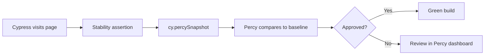

# Visual tests with Percy

Guide for **testflow-percy**: visual regression for [TestFlow](https://github.com/qaschoolbr/testflow) with Cypress + Percy.

Reference file: [`percy.cy.js`](../../../../cypress/e2e/visual/percy.cy.js).

## Goals

- Configure and run Percy snapshots on public and authenticated pages
- Use traceable IDs with `tc()` / `TC` enum
- Interpret diffs and update baselines in the Percy dashboard

## Prerequisites

- Node.js 20+ and `npm install`
- TestFlow at `http://localhost:5050` (`docker run -p 5050:5050 qaschool/testflow:latest`)
- `PERCY_TOKEN` to upload snapshots

## Scenarios

| ID | Scenario | Page |
|----|----------|------|
| TC-9001 | Login | `/web/login.html` |
| TC-9002 | Dashboard | `/web/dashboard.html` |
| TC-9003 | Components | `/web/components.html` |
| TC-9004 | Team | `/web/team.html` |
| TC-9005 | Settings | `/web/settings.html` |
| TC-9006 | Activity | `/web/activity.html` |
| TC-9007 | Wizard | `/web/wizard.html` |
| TC-9008 | States | `/web/states.html` |

## Test pattern

**Public page (login):**

```javascript
cy.visit('/web/login.html')
cy.getByTestId('login-email').should('be.visible')
cy.percySnapshot('Login Page')
```

**Authenticated page:**

```javascript
cy.visitWithSession('/web/dashboard.html')
cy.getByTestId('page-dashboard').should('exist')
cy.percySnapshot('Dashboard')
```

The assertion before the snapshot avoids blank or partially loaded captures. `visitWithSession` reuses `cy.session` so login is not repeated for every case.

## How to run

```bash
# Without Percy upload (validates visits / selectors / session)
npm run cy:run:visual

# With Percy CLI
export PERCY_TOKEN=your_token
npm run cy:run:visual:percy

# Interactive
npm run cy:open
```

## Percy config

[`.percy.yml`](../../../../.percy.yml):

- width `1280`, min-height `800`
- CSS disables `.spinner` animation (less flakiness)

## Flow



## Watchouts

1. Dynamic data (timestamps, avatars) cause diffs — hide or stabilize with `percy-css`
2. Fixed viewport in `cypress.config.js` (1280×800)
3. If an authenticated snapshot shows login, check `visitWithSession` / credentials

## References

- Spec: [`cypress/e2e/visual/percy.cy.js`](../../../../cypress/e2e/visual/percy.cy.js)
- Enum: [`cypress/support/@enums/testCases.js`](../../../../cypress/support/@enums/testCases.js)
- Percy docs: https://docs.percy.io/docs/cypress
