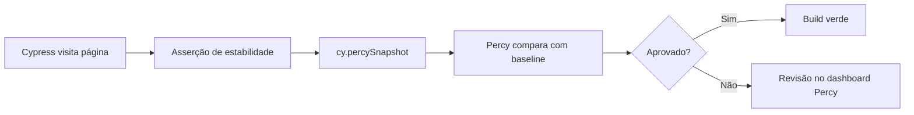

# Testes visuais com Percy

Guia do projeto **testflow-percy**: regressão visual do [TestFlow](https://github.com/qaschoolbr/testflow) com Cypress + Percy.

Arquivo de referência: [`percy.cy.js`](../../../../cypress/e2e/visual/percy.cy.js).

## Objetivos

- Configurar e executar snapshots Percy em páginas públicas e autenticadas
- Usar IDs rastreáveis com `tc()` / enum `TC`
- Interpretar diffs e atualizar baselines no dashboard Percy

## Pré-requisitos

- Node.js 20+ e `npm install`
- TestFlow em `http://localhost:5050` (`docker run -p 5050:5050 qaschool/testflow:latest`)
- `PERCY_TOKEN` para upload de snapshots

## Cenários

| ID | Cenário | Página |
|----|---------|--------|
| TC-9001 | Login | `/web/login.html` |
| TC-9002 | Dashboard | `/web/dashboard.html` |
| TC-9003 | Components | `/web/components.html` |
| TC-9004 | Team | `/web/team.html` |
| TC-9005 | Settings | `/web/settings.html` |
| TC-9006 | Activity | `/web/activity.html` |
| TC-9007 | Wizard | `/web/wizard.html` |
| TC-9008 | States | `/web/states.html` |

## Padrão dos testes

**Página pública (login):**

```javascript
cy.visit('/web/login.html')
cy.getByTestId('login-email').should('be.visible')
cy.percySnapshot('Login Page')
```

**Página autenticada:**

```javascript
cy.visitWithSession('/web/dashboard.html')
cy.getByTestId('page-dashboard').should('exist')
cy.percySnapshot('Dashboard')
```

A asserção antes do snapshot evita capturar tela em branco ou parcialmente carregada. `visitWithSession` reutiliza `cy.session` para não refazer login a cada caso.

## Como executar

```bash
# Sem upload Percy (valida visitas / seletores / sessão)
npm run cy:run:visual

# Com Percy CLI
export PERCY_TOKEN=seu_token
npm run cy:run:visual:percy

# Interativo
npm run cy:open
```

## Configuração Percy

Arquivo [`.percy.yml`](../../../../.percy.yml):

- largura `1280`, altura mínima `800`
- CSS que desativa animação de `.spinner` (reduz flakiness)

## Fluxo



## Pontos de atenção

1. Dados dinâmicos (timestamps, avatares) geram diffs — oculte ou estabilize com `percy-css`
2. Viewport fixo em `cypress.config.js` (1280×800)
3. Se o snapshot autenticado mostrar login, revise `visitWithSession` / credenciais

## Referências

- Spec: [`cypress/e2e/visual/percy.cy.js`](../../../../cypress/e2e/visual/percy.cy.js)
- Enum: [`cypress/support/@enums/testCases.js`](../../../../cypress/support/@enums/testCases.js)
- Docs Percy: https://docs.percy.io/docs/cypress
